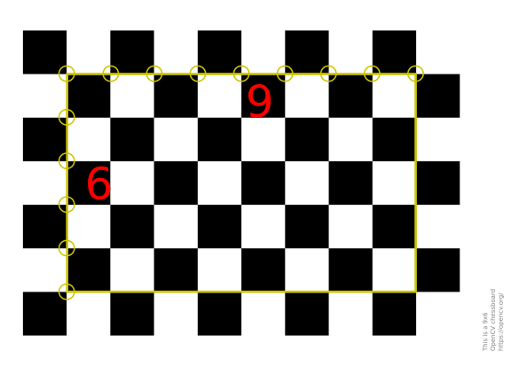
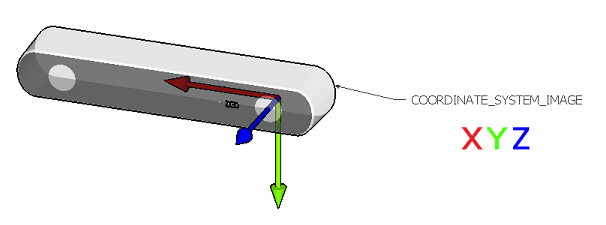

# ZED X One Stereo Calibration

This sample demonstrates how to calibrate two ZED X One monocular cameras set up in a custom baseline stereo configuration for use in the ZED SDK.

A calibration pattern is required, the bigger, the better. As a starting point a small printed chessboard (A4) can be used, make sure it's **flat** and that the dimension and characteristics are correctly [entered in the code](https://github.com/stereolabs/zedx-one-capture/blob/6c5254b728c5f683db373a1f4d66abead930b27f/stereo_calibration/main.cpp#L13-L15).


Other chessboard can be generated using OpenCV scripts https://docs.opencv.org/4.x/da/d0d/tutorial_camera_calibration_pattern.html

Before starting the calibration be sure to customize the code according to the type of calibration board you are using:

```C++
// CHANGE THIS PARAM BASED ON THE CHECKERBOARD USED
// https://docs.opencv.org/4.x/da/d0d/tutorial_camera_calibration_pattern.html
int target_w = 9; // number of horizontal inner edges
int target_h = 6; // number of vertical inner edges
float square_size = 25.0; // mm
```
> **Note:** the target Width and the target Height corresponds to the number of inner edges, not to the number of outer squares.



## Perform the calibration

The calibration process uses images saved manually with the chessboard visible and at different position each time in the image.

When calibrating, make sure the calibration pattern is seen in all the field of view of the camera along the process.

> **Note:** If the calibration tool appears frozen, simply wait a few seconds for the current process to complete. We recommend using the `MAXN` power mode and running the `jetson_clocks` script before initiating the process to enhance performance.

### Step 1: move the chessboard

Move the chessboard and press the `s` key to save images. 

Each time you save a frame, the tool calculates the area of the image covered by the calibration board and highlights it with a 'green zone.' When the left image is fully covered by green, then **step 1** is completed.

### Step 2: rotate the chessboard

Move the chessboard away/close to the camera and rotate it around the three main axis.

The chessboard needs to be rotated around each axis at different distances. The GUI will indicate which axis should be further adjusted.



The calibration process will start automatically when all the axes are fully covered.

> **WARNING**: never rotate the chessboard around the Z axis with an angle greater than 60°; otherwise, the algorithm will incorrectly detect the chessboard in portrait mode instead of landscape, causing unpredictable behaviors.

### Step 3: calibration processing

Once enough images have been saved, the calibration process will be automatically initiated, and a "conf" file readable by the ZED SDK will be generated.

The "conf" file should be renamed using the **virtual serial number** selected in the **ZED Media Server** tool.

Read the [detailed documentation](https://www.stereolabs.com/docs/get-started-with-zed-x-one/zed-x-one-stereo/) for more information.

### Video Tutorial

This video tutorial demonstrates the necessary steps to achieve a valid calibration.

[](https://www.youtube.com/watch?v=Dd-4_eUdkSM)
